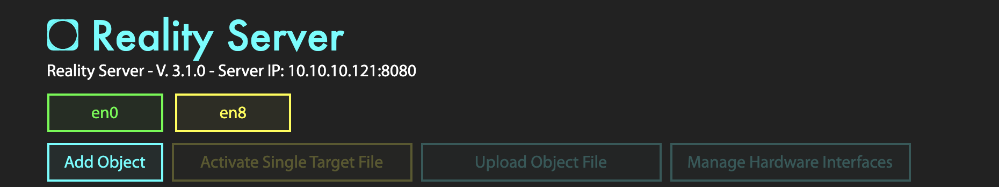

# KineticAR for Developers - Tutorial

This is a reference to build a **Reality Editor** interface for any moving robot in 2D or 3D. 
The **Kinetic AR** interface works with two components:
* **Kinetic AR Frame in an Object**
* **Kinetic AR Hardware Interface.**

It allows a connection to the robot and a full spatial synchronization 
between the robot coordinate system and the Vuforia groundplane coordinate system. 
It also allows for path planning and motion visualization in AR in real-time.

## Getting Started

These instructions will explain how to setup the Kinetic AR interface. You will have to download the code for both the server and the KineticAR Frame from [our repository]().

### Prerequisites

The robot you want to use needs a remote connection and you need to understand the communication protocols involved to:

* Get the robot status
* Send a command to the robot in order to send it to a final position and rotation
* Steer the robot in realtime [optional]

The example here uses a Rest API and WebSockets in order to communicate with an AGV. You will need to adapt the code to be able to communicate with your specific hardware.
This was initially built for an MIR100 robot. But can be adapted to any other robot. 

## KineticAR Hardware Interface

Download the Reality Server code and place it in your Development folder on your computer. Find the following folder:

```
RE-server/hardwareInterfaces/KineticAR 
```

This folder contains all the code you need for your Reality Server hardware interface. A hardware interface is in charge of communicating with a specific piece of hardware.
The KineticAR hardware interface will be in charge of talking to the robot and generating the specific nodes and logic needed for path planning.
In order to create your own, duplicate this folder and change the KineticAR name to your robot name.

## Reality Server

In order to run the server, you will need Node.js installed on your computer. 
Install [node.js](https://nodejs.org).<br />
Open a terminal window and navigate to your RE-server folder.
Run the following:

```
npm install
```

This will install all the Node.js dependencies needed in your Reality Server. Now you can run the server as follows:

```
node server.js 
```

Open a browser and go to:

```
localhost:8080
```

The Reality Server interface should load on the browser. 
Here, you will find a list with all the Reality Objects available.
The first time you run the Reality Server, it will be empty.

 

## Reality Objects

In your computer, the Reality Objects are stored in the following folder:

```
Documents/realityobjects
```

This folder gets generated the first time you run the Reality Server.

## Kinetic AR Object and Frame

You will need a virtual object that will represent your physical object (your robot) and a KineticAR frame attached to it. 
> An object is a reference to your world physical object (aka your robot). 
The frame is a piece of AR content that will be attached to your physical object or physical surroundings.<br /> 

### Creating Object and Frame through the Reality Server

Your object will need a Vuforia object target in order to be identified and tracked.
First, download the object target files from the [Vuforia Developer Portal](https://developer.vuforia.com/).
Then follow this steps on the Reality Server interface on your browser:

* Click on 'Add Object'. Give this object the following name: 'robot'.
* Click on 'Add Target'
* Drop zip file or separate files (dat, xml and jpg) to the drop zone. The [OFF] button should turn to [ON]
* Click on 'Add Frame'. Give this frame the following name: 'kineticAR'

At this moment, if you go to your file system and navigate to the realityobjects folder, you should see that a folder has been created for your object and your frame.

```
Documents/realityobjects/yourObjectName/kineticAR
```

In this frame folder you will host the code that will generate the KineticAR frame once you detect your robot.
By default you will see two files: index.html and bird.png. Delete both files. <br />
Download the [kineticAR Frame code](link) from our repository and copy all the contents inside of the kineticAR folder.

### Initializing your frame

You installed Node.js previously for the server, so you can now open a terminal window, navigate to your frame folder and type the following:

```
npm install
```

This will install all Node.js dependencies needed on your frame.
In order to develop on this frame you will have to generate the bundle.js file that will contain all your frame code compiled in one file only.
If your purpose is to only run this frame but not develop, type this on the terminal:

```
npm run build
```

If your purpose is to develop, type this instead:

```
npm run watch
```

The second command will trigger the generation of the bundle.js file every time there is a change in your code.

## Testing

At this point, you have everything setup and you should test to make sure that everything works together.
Follow these steps to ensure that your code runs properly.

* Make sure the computer running the server and the smartphone with the Reality Editor application are on the same network.
* On your terminal, navigate to the folder 'RE-server'
* Type:

```
node server.js
```

* Open the Reality Editor application on the phone
* On the side menu on the phone, click on the configuration gear
* Go to 'Found Objects'

Here, you will see a list of Objects that the server is looking for. Your object should be on this list.<br />
If your object is not on this list, something went wrong. Check out our troubleshooting section.

If your object is on the list, point with the phone at your physical object (aka your robot).
If your object target works, the main UI of the KineticAR frame should appear on the phone.

 

## Authors

* **Anna Fuste**

See also the list of [contributors](https://github.com/your/project/contributors) who participated in this project.

## License

This project is licensed under the MIT License - see the [LICENSE.md](LICENSE.md) file for details

## Acknowledgments

* Hat tip to anyone whose code was used
* Inspiration
